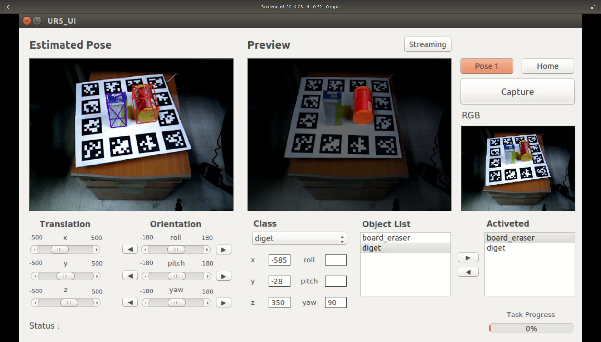

# 6D Pose Data Collecting Tool
6D pose data collecting tool with ArUco marker

## UI


## Requirement
* python 2.7
* opencv-python
* PyQt5
* cv_bridge
* numpy
* PyKDL
* json
* ruamel.yaml
* vispy==0.5.3
* OpenGL
* pyglet==1.3.2

## Data Organzation
* 6D-pose-data-collecting-tool
  * models
    * obj.ply (CAD file)
  * dataset
    * obj
      * labels: Label data for SINGLESHOTPOSE
      * mask: Object masks (maximum value=255)
  * tmp_data
    * obj
      * inspection: 6D pose visualization (3D bounding box)
      * JPEGImages: RGB images
      * rotation: Rotation matrix
      * translation: Translation matrix
     
## Note
* CAD files of objects must be saved with a **ply** extension (in meters).
* CAD file name and the class name should be the same.
* Camera parameters must be set.
* X-shaped lines are drawn in the Y and Z directions on the UI

## Usage
1. Change ***config.json*** according to your configuration.
  * CAMERA_INTRINSIC: Camera intrinsic matrix
  * MODEL_PATH: CAD file path
2. Run data_collector.py

```
python data_collector.py
```
3. Collect data by following the video below.

[](https://youtu.be/6bgV5Z1S6Fs?t=0s)

4. Run data_generator.py

```
python data_generator.py
```

5. Have fun with 6D pose data
